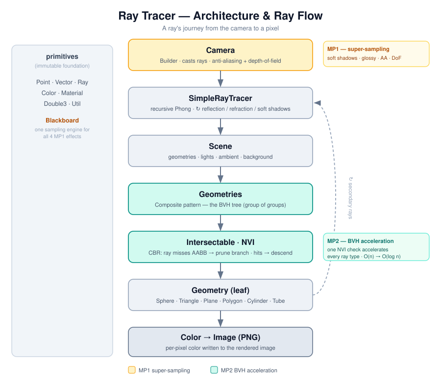
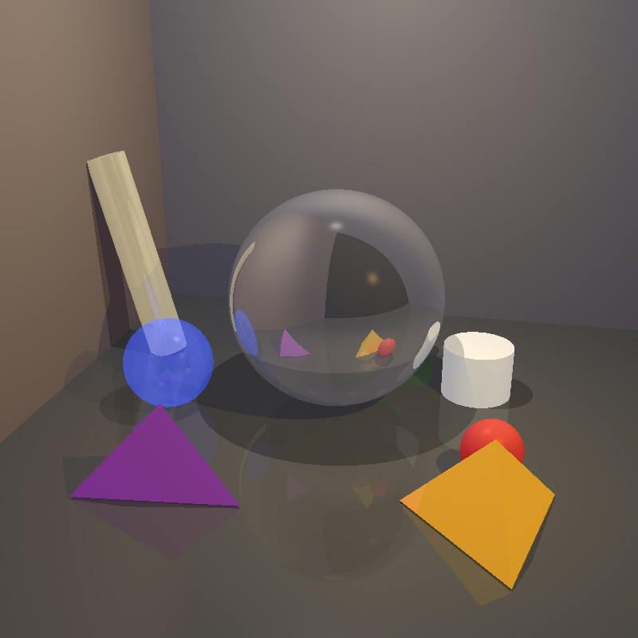
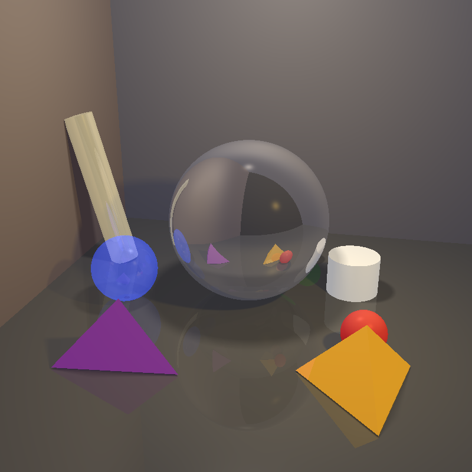
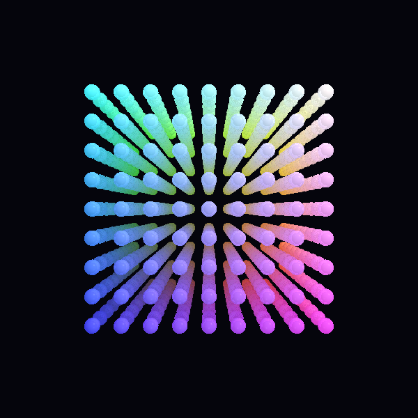
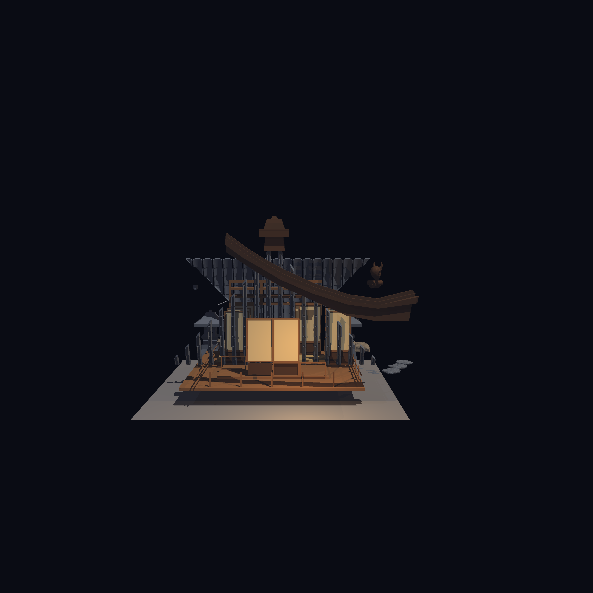

# 🎨 Java Ray Tracer

A from-scratch **ray tracer** written in Java, built incrementally across nine
stages and two mini-projects. It renders 3D scenes with shadows, reflection,
refraction, advanced super-sampling effects, multi-threading, and a **Bounding
Volume Hierarchy (BVH)** that makes rendering hundreds of thousands of triangles
practical.

> **Course:** Introduction to Software Engineering · JCT
> **Project:** `ISE5786_3851_1182`
> **Author:** _<your name & ID here>_

---

## 📈 Results at a glance

|                           |                                                            |
|---------------------------|------------------------------------------------------------|
| 🧱 Largest scene rendered | **684,729 triangles** (Blender shrine) — in **~53 s**      |
| ⚡ BVH speed-up            | **15.5×** (acceleration alone)                             |
| 🚀 BVH + multi-threading  | **17.6×** (563 s → 32 s)                                   |
| 🎯 Correctness proof      | accelerated & unaccelerated images are **pixel-identical** |

---

## Table of Contents

1. [Architecture & Design](#-architecture--design)
2. [Mini-Project 1 — Super-Sampling Effects](#-mini-project-1--super-sampling-effects)
3. [Mini-Project 2 — BVH Acceleration](#-mini-project-2--bvh-acceleration-the-headline)
4. [Showcase: The Zen Shrine](#-showcase-the-zen-shrine-685k-triangles)
5. [Loading Scenes from JSON](#-loading-scenes-from-json)
6. [How to Run](#️-how-to-run)
7. [Project Structure](#-project-structure)
8. [Bonus Checklist](#-bonus-checklist)

---

## 🏛 Architecture & Design



The code is organized by responsibility around three core design patterns.

```
src/
├── primitives/        Point, Vector, Ray, Color, Material, Double3, Util, Blackboard
├── geometries/
│   ├── api/           Intersectable (NVI), Geometry, AABB
│   └── impl/          Sphere, Plane, Triangle, Polygon, Tube, Cylinder, Geometries
├── lighting/          LightSource, AmbientLight, DirectionalLight, PointLight, SpotLight
├── scene/             Scene
├── renderer/          Camera (Builder), RayTracerBase, SimpleRayTracer
└── parser/            JsonParser, SceneBuilder, SceneLoader, BlenderMeshLoader
```

| Pattern                         | Where                             | Why it matters                                                                                             |
|---------------------------------|-----------------------------------|------------------------------------------------------------------------------------------------------------|
| **NVI** (Non-Virtual Interface) | `Intersectable.calcIntersections` | One `final` chokepoint every ray passes through — lets the BVH accelerate **all** ray types with one line. |
| **Composite**                   | `Geometries`                      | A `Geometries` of `Geometries` **is** the BVH tree — no separate tree class needed.                        |
| **Builder**                     | `Camera`                          | Fluent, immutable camera configuration.                                                                    |

Conventions: instance fields are prefixed `_`, every class/method has Javadoc, and
geometric objects are immutable (except the `Camera` builder).

---

## 🌓 Mini-Project 1 — Super-Sampling Effects

All four super-sampling effects share **one** reusable engine: the
[`Blackboard`](src/primitives/Blackboard.java) class, which generates sample
points across a target area (grid / random / jittered patterns; square or circular
shape). Each effect is a thin layer on top — no sampling logic is duplicated.

### Soft Shadows — a visible difference 👀

Instead of one shadow ray per light, an **area light** casts a *beam* of rays
across a disk; averaging them produces a gradient penumbra. The average divides by
**all** samples (including those blocked below the surface horizon), which
reproduces the natural "sunset effect" of a partially visible light.

|         Hard shadows — `setSize(0)`         |        Soft shadows — `setSize(15)`         |
|:-------------------------------------------:|:-------------------------------------------:|
|  |   |
|     Sharp, binary shadow edges · ~1.5 s     | Gradient penumbra · ~9 s (81 samples/light) |

> Same scene, same code — only the **light-size parameter** changes. There is no
> "soft-shadow mode" branch in the renderer; everything is parameter-driven, so
> all earlier-stage tests keep working unchanged.

### Bonus effects (all built on `Blackboard`)

- **Glossy reflection / diffuse glass** — blurred mirror & frosted glass. Here the
  average divides by **valid rays only**, because a ray pointing to the wrong side
  of the surface is physically impossible (unlike a blocked shadow ray, which is a
  real zero-contribution sample).
- **Anti-aliasing** — multiple rays per pixel remove jagged edges.
- **Depth of field** — an aperture + focal plane blur out-of-focus regions.
- **Jittered sampling** — grid + small random offset, removing banding without
  clustering.

<!--
  Optional: render ON/OFF pairs of these effects and drop them in here, e.g.
  | Anti-aliasing OFF | Anti-aliasing ON |
  |:---:|:---:|
  |  |  |
-->

---

## ⚡ Mini-Project 2 — BVH Acceleration (the headline)

Originally the tracer tested **every ray against every geometry** — O(n) per ray.
The **Bounding Volume Hierarchy** wraps geometries in nested **Axis-Aligned
Bounding Boxes**. A ray-box test is cheap; if a ray misses a box it cannot hit
anything inside, so whole branches are skipped — dropping the per-ray cost to
roughly **O(log n)**.

**How it's built:**

1. [`AABB`](src/geometries/api/AABB.java) — an axis-aligned box with a fast
   **slab-method** ray-box test.
2. Each geometry computes its own box (`calculateBoundingBox()`); infinite shapes
   (plane, tube) return an *infinite* box so they are never wrongly pruned.
3. The box test is injected once into the NVI wrapper
   [`Intersectable.calcIntersections`](src/geometries/api/Intersectable.java), so
   it accelerates **camera, shadow, reflection and refraction rays alike**.
4. [`Geometries.buildHierarchy()`](src/geometries/impl/Geometries.java)
   automatically restructures the flat scene into a balanced binary tree (split
   along the longest centroid axis at the median), reusing the **Composite**
   pattern as the tree itself.

Acceleration is toggled **purely from the tests** by calling `buildHierarchy()`.
When it isn't called, no boxes are built and the renderer behaves exactly as
before — so the "off" baseline is genuinely unaccelerated.

### Same picture, 17.6× faster

The acceleration changes **speed only, never the image** — so the "before" and
"after" frames below are *pixel-identical*. That identity is the proof the BVH is
correct: it prunes only rays that provably miss.

|                🐢 Without BVH                 |               🚀 With BVH                |
|:---------------------------------------------:|:----------------------------------------:|
|  |  |
|                 **563.48 s**                  |               **31.93 s**                |

### 📊 Full measurements

Benchmark: **729 spheres + 5 area lights + soft shadows**, 600×600.

| Configuration                                      | Render time |  Speed-up |
|----------------------------------------------------|------------:|----------:|
| Acceleration **OFF**, threads **OFF** *(baseline)* |    563.48 s |        1× |
| Acceleration **OFF**, threads **ON**               |    228.65 s |      2.5× |
| Acceleration **ON**, threads **OFF**               |     36.29 s | **15.5×** |
| Acceleration **ON**, threads **ON**                |     31.93 s | **17.6×** |

**What the numbers teach us**

- **BVH alone** delivers most of the win (~15.5×) — spatial pruning eliminates
  almost all wasted intersection tests.
- **Multi-threading alone** gives only ~2.5×, limited by the memory-bandwidth
  bottleneck of concurrent scene access.
- **Combined**, BVH + threads is only slightly faster than BVH alone — once the
  hierarchy removes most of the work, there is little left to parallelize. A
  textbook case of **diminishing returns**.

---

## 🏯 Showcase: The Zen Shrine (685k triangles)

To stress-test the BVH, a full **Blender model** was imported — a zen shrine of
**684,729 triangles**. Without acceleration this scene is effectively
unrenderable; with the BVH it renders in under a minute.



```
[Shrine] loaded 684729 triangles (skipped 0 degenerate)
[Shrine] BVH built in 10.3 s
[Shrine] total time 52.9 s
```

The model is loaded by
[`BlenderMeshLoader`](src/parser/BlenderMeshLoader.java), which fan-triangulates
every polygon, rotates Blender's Z-up into the project's Y-up, scales the model up,
colors each surface from its **material name** (`...roof_stone...` → slate,
`...base_wood...` → brown, `...chrome...` → metal) via a **colored diffuse
coefficient** so it is properly *shaded*, and skips degenerate faces so one bad
triangle can't crash the load.

---

## 📂 Loading Scenes from JSON

As a **Stage-5 bonus**, scenes load from JSON files with a clean separation of
concerns inside the [`parser`](src/parser) package:

- [`JsonParser`](src/parser/JsonParser.java) — pure JSON text → generic tree
  (knows nothing about scenes).
- [`SceneBuilder`](src/parser/SceneBuilder.java) — generic tree → `Scene` /
  geometries / lights / materials (knows nothing about JSON syntax).
- [`SceneLoader`](src/parser/SceneLoader.java) — the facade the tests call.

No parsing logic lives in the tests, camera, or ray tracer — satisfying SRP, OOP,
DRY, and the requirement that the loader be extensible to future stages.

```json
{
  "scene": {
    "background-color": "75 127 90",
    "ambient-light": {
      "color": "255 191 191"
    },
    "geometries": [
      {
        "type": "sphere",
        "center": "0 0 -100",
        "radius": 50
      },
      {
        "type": "triangle",
        "p0": "-100 0 -100",
        "p1": "0 100 -100",
        "p2": "-100 100 -100"
      }
    ]
  }
}
```

---

## ▶️ How to Run

The project uses **JUnit 5**. Run any test class from your IDE.

**Recommended JVM options** (for large scenes / the shrine):

```
-Xms1G -Xmx8G -XX:+UseParallelGC -XX:ParallelGCThreads=4
```

| Test                 | Renders                                           |
|----------------------|---------------------------------------------------|
| `RenderTests`        | Basic two-color scene + JSON-loaded scene         |
| `SuperSamplingTests` | Soft shadows ON vs OFF                            |
| `BvhTimingTests`     | The four BVH timing configurations                |
| `ShrineTest`         | The 685k-triangle Blender shrine (needs `-Xmx8G`) |

Output images are written to the `images/` folder.

---

## 🗂 Project Structure

```
ISE5786_3851_1182/
├── src/                 production code (see Architecture above)
├── unitTests/           JUnit test classes
├── scenes/              JSON scene files (basicRenderTestTwoColors.json, blender_export.json)
├── images/              rendered output (.png)
└── README.md
```

**Key files:** [`Blackboard`](src/primitives/Blackboard.java) · [
`SimpleRayTracer`](src/renderer/SimpleRayTracer.java) · [`Camera`](src/renderer/Camera.java) · [
`AABB`](src/geometries/api/AABB.java) · [`Intersectable`](src/geometries/api/Intersectable.java) · [
`Geometries`](src/geometries/impl/Geometries.java) · [`BlenderMeshLoader`](src/parser/BlenderMeshLoader.java)

---

## ✅ Bonus Checklist

Every bonus below is backed by a direct link to the source that implements it.

| ✅ | Bonus                                                                          | Stage     | Implemented in                                                                                                                             |
|:-:|--------------------------------------------------------------------------------|-----------|--------------------------------------------------------------------------------------------------------------------------------------------|
| ✅ | **Jittered sampling pattern**                                                  | MP1       | [`Blackboard.java`](src/primitives/Blackboard.java)                                                                                        |
| ✅ | **Glossy reflection / diffuse glass**                                          | MP1       | [`SimpleRayTracer.java`](src/renderer/SimpleRayTracer.java) — `calcGlobalEffectBeam`                                                       |
| ✅ | **Anti-aliasing**                                                              | MP1       | [`Camera.java`](src/renderer/Camera.java) — `computeColorAntiAliasing`                                                                     |
| ✅ | **Depth of field**                                                             | MP1       | [`Camera.java`](src/renderer/Camera.java) — `computeColorDoF`                                                                              |
| ✅ | **Multi-threading** (3 strategies)                                             | MP1 / MP2 | [`Camera.java`](src/renderer/Camera.java) — `renderImageStream` / `renderImageRawThreads`                                                  |
| ✅ | **Multiple sampling shapes & patterns** (square/circle · grid/random/jittered) | MP1       | [`Blackboard.java`](src/primitives/Blackboard.java)                                                                                        |
| ✅ | **Scene loading from JSON**                                                    | Stage 5   | [`JsonParser`](src/parser/JsonParser.java) · [`SceneBuilder`](src/parser/SceneBuilder.java) · [`SceneLoader`](src/parser/SceneLoader.java) |
| ✅ | **Blender mesh import** (685k-triangle showcase)                               | extra     | [`BlenderMeshLoader.java`](src/parser/BlenderMeshLoader.java)                                                                              |

> The assigned deliverables — **Soft Shadows** (MP1) and the **BVH acceleration**
> (MP2) — are core requirements rather than bonuses, and are documented in their
> sections above.

---

*Built as part of the Introduction to Software Engineering course at JCT.*